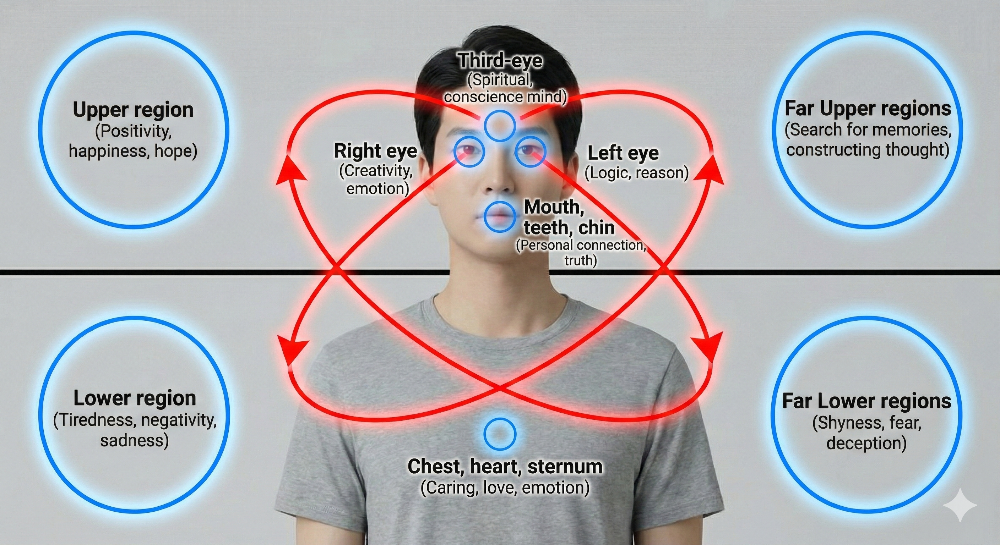

# HCEP — Human Communication Eye Protocol

[]()
[]()
[]()
[]()
[]()

**HCEP** is a real-time multi-modal perception platform that fuses sensor input (Kinect v1 or standard USB webcams) with a hybrid LLM engine to analyze human communication through eye contact patterns, facial expressions, body tracking, and speech.

It implements Kirk LaSalle's **HCEP (Human Communication Eye Protocol)** theory — a novel 5-mode cognitive-emotional classification system that decodes the unspoken language of eye contact during face-to-face conversation. This the current basic version. It is designed to be expanded upon with more features and capabilities.

---

## The 5 HCEP Modes

| Mode | Eye Pattern | Cognitive State | AI Response Style |
|---|---|---|---|
| **LOGIC** | Structured gaze, on-face | Analytical processing | Precise, factual, numbered lists |
| **AFFECT** | Social Triangle (eyes + mouth) | Emotional engagement | Warm, empathetic, feeling-first |
| **SPIRIT** | Sustained mutual gaze | Deep authentic rapport | Personal, genuine, unstructured |
| **HEART** | Lower-face + empathic markers | Empathic resonance | Supportive, validating, caring |
| **THINK** | Gaze aversion, defocused | Internal processing | Brief, non-intrusive, space-giving |

---

## Screenshot



The HCEP dashboard provides a real-time 3-column layout with live sensor feed, gaze/face visualization, and AI assistant:

- **Left**: Live Kinect/Webcam RGB video with skeleton wireframe overlay (20-joint full body or 10-joint seated), face bounding box, and 87-point facial feature wireframe
- **Center**: HCEP mode classification, gaze/cognitive/valence state, face schematic with gaze crosshair, action unit bars, head pose, and speech log
- **Right**: Pipeline metrics (FPS, latency, tracked persons) and LLM chat assistant

All panel boundaries are drag-resizable via visible GridSplitters.

---

## True Gaze™ Parallax Calibration

To eliminate gaze skewing caused by off-axis sensor placement (such as mounting a webcam on top of a monitor bezel), HCEP implements a dynamic 3D coordinate co-registration. This shifts tracking perspective from the sensor's lens center back to the active user-avatar focal line of sight:


---

## Features

### Sensor Input & Hardware Fallback

- 30fps color, depth, skeleton, face, and audio streams
- Full-body (20-joint) and seated (10-joint) skeleton tracking with runtime toggle
- **Webcam Sensor Source:** Native fallback to standard OpenCV USB webcams or simulated developer input when specialized hardware is absent
- 87+ 2D/3D facial feature points per frame
- 6 Action Units (lip raise, jaw lower, lip corner, brow lower, brow raise, outer brow raise)
- 4-microphone beam-formed audio array with source angle

### Gaze Estimation & Correction

- 3-stage pipeline: PnP Head Pose (with Levenberg-Marquardt optimizer) → Eye-in-Head Rotation → Hybrid Fusion
- **True Gaze™ Parallax Correction:** Calibrates gaze yaw/pitch relative to 3D socket centers to resolve camera off-axis perspective skews
- Confidence cone gaze target classification (13 regions)
- Temporal smoothing with exponential moving average and hysteresis threshold gating
- Saccade detection using Main Sequence equation
- **Simulation-Based Accuracy:** Verified using synthetic datasets at 84.55% classification accuracy and Cohen's Kappa of 0.8084


### Plugin API & LLM Integrations

- **Model Context Protocol (MCP):** Serves JSON-RPC tools list and HCEP state snapshots over `POST /mcp`
- **OpenAI Function Calling:** Auto-generates GPT-4/o1 tool invocation schemas at `/api/tools/openai`
- **SDK Integrations:** Built-in wrappers for LangChain, LlamaIndex, Semantic Kernel, Unity (C#), and Unreal Engine (C++)
- **Enterprise-Grade Compliance:** AES-256 equivalent DPAPI key storage, GDPR user erasure, and UI biometrics consent dialogs

### HCEP Analysis

- Real-time 5-mode classification (LOGIC, AFFECT, SPIRIT, HEART, THINK)
- Temporal hysteresis (5-frame stability, ~170ms at 30fps)
- 12 cognitive state classifications
- Emotional valence from Action Unit weights
- Social Triangle detection for AFFECT mode

### Video Overlays

- Full-body skeleton wireframe (green solid lines for tracked, dashed for inferred joints)
- Automatic sitting/standing detection with posture label
- Face bounding box (yellow rectangle)
- 87-point facial feature wireframe with edge chains (eyes, eyebrows, lips, jaw, nose)
- Pupil markers (magenta dots at indices 69, 73)
- Pinhole camera projection (fx=fy=525, cx=320, cy=240)

### Face & Identity

- ArcFace ONNX 512-dimensional face embedding extraction
- Cosine similarity identity matching (>0.6 threshold)
- Persistent identity enrollment and recognition across sessions

### Speech — Real-Time TTS/STT (HCEP.Speech)

- **Streaming Text-to-Speech**: `HybridTtsEngine` routes automatically to the best available backend:
  - **Windows SAPI** (offline, always available) — phoneme-accurate lip sync via `VisemeReached`
  - **OpenAI TTS** (`tts-1`, `tts-1-hd`) — high-quality cloud voices, 6 voice options
  - **ElevenLabs** (`eleven_turbo_v2_5`) — highest quality, lowest latency streaming
- **Phoneme-to-Viseme Lip Sync** ✅ *Implemented (Phase 13)*:
  - `VisemeController` maps all 21 SAPI phoneme groups to 5 normalised mouth parameters (jaw open, lip round, lip spread, lip compressed, upper lip retract) per the Preston Blair animation canon (1949)
  - `ISpeechSynthesizer.VisemeChanged` fires per-phoneme at ~50–200ms intervals during TTS synthesis
  - 2D Happy Face: `MouthFill` Ellipse opens with jaw; `SmilePath` reshaped per viseme; 60ms EMA co-articulation
  - 3D Wireframe: `DrawMouth3D()` draws proportional bezier mouth arc scaled to eye socket radius
  - Scientific basis: McGurk & MacDonald (1976) — visual mouth movement is a first-class speech channel. Sumby & Pollack (1954) — accurate lip sync provides up to 15 dB SNR improvement in noise.
- **Eyebrow Animation** ✅ *Implemented*:
  - Both avatars animate AU3 (BrowLowerer) and AU5 (OuterBrowRaiser) from Kinect
  - Autonomous HCEP-mode driven expressions: LOGIC/THINK → furrow; HEART → empathy raise; AFFECT → open/engaged
  - 150ms EMA smoothing; quadratic bezier geometry rebuilt at 30Hz

### Intelligence Layer

- **Hybrid LLM**: Local Ollama (llama3:8b) + Cloud GPT-5-mini
- HCEP-aware system prompts that modulate AI behavior per mode
- Automatic local/cloud routing (THINK/LOGIC → local, SPIRIT/AFFECT/HEART → cloud)
- 5-step agentic reasoning loop with tools: `query_knowledge`, `get_hcep_state`, `store_knowledge`, `summarize_person`, `analyze_gaze_pattern`
- **Cloud Circuit Breaker**: Opens after 3 consecutive cloud failures; all calls are short-circuited for a 30-second cool-down before retry
- **Windows Credential Manager**: API keys are read from the WCM vault (`HCEP/OpenAI`, `HCEP/Anthropic`, etc.) first, falling back to environment variables — keys are never exposed in process listings
- **Contextual Intelligence** ✅ *Implemented (Phase 14)*:
  - `ContextSnapshot` model captures Time × Space × Situation; injected as `[TimeOfDay | DayType | Season | Environment | Activity | Register | SilenceProtocol | TZ]` into every LLM prompt
  - `TimeContextProvider` classifies time-of-day band, day type, season; derives `CommunicationRegister` and `TemporalUrgency`
  - `SilenceProtocolEvaluator` — 7 rules determine when the avatar should stay silent (Jaworski, 1993; Duncan, 1972); THINK mode + gaze aversion → do not speak; direct gaze → floor yielded

### Knowledge & Memory

- Per-person knowledge accumulation (sightings, utterances, exchanges)
- Strategy D: UKS (BrainSim III) hybrid adapter with auto-fallback to in-memory store
- JSON persistence across sessions
- Natural-language summarization for LLM context injection
- **Capacity-limited triple store**: Configurable `MaxSubjects` (500) and `MaxTriplesPerSubject` (1000) with LRU eviction — prevents unbounded memory growth in long sessions
- **Input validation**: Subject (≤255 chars), relation (≤100 chars), object (≤10,000 chars) bounds enforced on all writes

### Dashboard UI (WPF)

- Dark-themed 3-column resizable layout
- Live RGB video with skeleton/face overlays
- Real-time face schematic with gaze crosshair and region dots
- HCEP mode display with confidence bar
- Gaze, cognitive state, and valence indicators
- Action Unit bar charts
- Head pose (pitch, yaw, roll)
- Pipeline metrics (FPS, vision latency, tracked persons, beam angle)
- Speech transcript log
- LLM chat interface
- Full Body toggle button (switches Kinect between 20-joint and 10-joint tracking)
- Sensor Streams and Kinect Video child windows

---

## Production Hardening (Audit v1.1 — 2026-07-03)

A full security and reliability audit was completed on 2026-07-03. All 21 identified issues were resolved. Key changes:

| Category | Change |
|---|---|
| **Thread Safety** | Replaced incorrect `Interlocked.CompareExchange` volatile-read pattern with `Volatile.Read/Write` on all cross-thread shared-state properties in `VisionPipeline` |
| **Resilience** | Cloud LLM circuit breaker: opens after 3 consecutive failures, short-circuits for 30 s, resets on success |
| **Security** | `WindowsCredentialStore` wraps Windows Credential Manager — API keys stored encrypted in WCM vault, never visible in process listings |
| **Memory Safety** | `InMemoryKnowledgeStore` now has configurable capacity limits (500 subjects × 1,000 triples) with LRU eviction |
| **Observability** | Frame-drop warnings on all channel back-pressure paths; audio flush errors escalated from `LogDebug` to `LogWarning`; no-LLM fallback logged explicitly |
| **Fault Tolerance** | `ArcFaceRecognizer.LoadModel()` no longer crashes on corrupted ONNX files; `FaceTracking` init correctly separates `DllNotFoundException` from runtime failures |
| **Configurability** | Auto-fallback timeout (`AutoFallbackSeconds`) is now a public property (was a hardcoded `const`) |
| **Documentation** | All empirical constants (`HeadWeight`, `ModeStabilityFrames`, `GazeAversionAngleDeg`, PnP epsilon) now have XML doc comments with research basis |
| **Tests** | 21 new tests: concurrency stress, negative-path (corrupted models, capacity limits), circuit-breaker verification |

See [CHANGELOG.md](CHANGELOG.md) for the full list of changes.

---

## Architecture

```
┌─────────────────────────────────────────────────────────────────┐
│                          HCEP.App (WPF)                        │
│   MainWindow · MainViewModel · HcepPipelineOrchestrator        │
│   VideoOverlayControl · GazeVisualizationControl               │
├───────────────────────┬─────────────────────────────────────────┤
│   HCEP.Intelligence   │          HCEP.Knowledge                │
│  HybridLlmEngine      │  UksKnowledgeAdapter (Strategy D)      │
│  AgenticToolExecutor   │  InMemoryKnowledgeStore                │
│  HcepPromptBridge      │  PersonKnowledgeManager                │
├───────────────────────┼─────────────────────────────────────────┤
│   HCEP.Vision         │          HCEP.Audio                    │
│  ArcFaceRecognizer     │  WhisperSpeechRecognizer               │
│  HcepModeAnalyzer      │  AudioPipeline                        │
│  VisionPipeline        │                                       │
├───────────────────────┼─────────────────────────────────────────┤
│   HCEP.Spatial        │          HCEP.Kinect                   │
│  ThreeStageGaze        │  KinectSensorSource (native COM)      │
│  PnPSolver             │  SimulatedSensorSource                │
│  ConfidenceCone        │                                       │
├───────────────────────┴─────────────────────────────────────────┤
│   HCEP.Core (Enums · Models · Interfaces · Channels)           │
├─────────────────────────────────────────────────────────────────┤
│   HCEP.Telemetry (Serilog · Metrics · FPS)                     │
└─────────────────────────────────────────────────────────────────┘
```

**12 projects** | **193 unit tests** | **.NET 9.0** | **x64 only**

---

## Project Structure

```
HCEP/
├── HCEP.sln                          # Root solution
├── Directory.Build.props             # Shared MSBuild properties (net9.0-windows, x64)
├── run.bat                           # Build & run script
├── docs/
│   ├── PRD.md                        # Product Requirements Document
│   ├── ROADMAP.md                    # Development roadmap (v0.1 → v1.0)
│   ├── USER_GUIDE.md                 # End-user guide
│   └── DEVELOPER_GUIDE.md           # Developer reference
├── src/
│   ├── HCEP.Core/                    # Enums, models, interfaces, channels (zero deps)
│   ├── HCEP.Telemetry/              # Serilog logging, FPS counter, moving average
│   ├── HCEP.Spatial/                # Gaze math: PnP, ray-plane, confidence cone, coord mapper
│   ├── HCEP.Kinect/                 # Kinect v1 native COM + simulated source
│   ├── HCEP.Kinect.Bridge/         # .NET Framework 4.8.1 bridge for managed Kinect SDK
│   ├── HCEP.Vision/                 # ArcFace recognition, HCEP mode analyzer, vision pipeline
│   ├── HCEP.Audio/                  # Whisper speech-to-text, audio pipeline
│   ├── HCEP.Knowledge/             # Knowledge store, UKS adapter, person memory
│   ├── HCEP.Intelligence/          # Hybrid LLM engine, agentic tools, prompt bridge
│   └── HCEP.App/                    # WPF application, DI host, orchestrator, UI controls
└── tests/
    └── HCEP.Tests/                   # xUnit tests (211 passing)
        ├── Spatial/                  # Ray-plane, coordinate mapper, PnP, confidence cone
        ├── Knowledge/               # In-memory store, UKS adapter, person knowledge
        ├── Intelligence/            # Agentic tools, prompt bridge, tool definitions, circuit-breaker tests
        ├── Vision/                  # HCEP mode analyzer, ArcFace negative-path tests, concurrency tests
        └── Core/                    # Models, enums, constants
```

---

## Prerequisites

| Component | Version | Required |
|---|---|---|
| Windows 10/11 | x64 | Yes |
| .NET SDK | 9.0+ | Yes |
| Kinect for Windows SDK | v1.8 | Yes (for live sensor) |
| Kinect Developer Toolkit | v1.8 | Yes (for face tracking) |
| Ollama | Latest | Optional (local AI) |
| OpenAI API key | — | Optional (cloud AI) |

### Model Files (not included in repo)

| Model | File | Size | Purpose |
|---|---|---|---|
| Whisper base.en | `ggml-base.en.bin` | ~140 MB | Speech recognition |
| ArcFace ResNet100 | `arcfaceresnet100-11-int8.onnx` | ~120 MB | Face recognition |

---

## Quick Start

### Build & Run

```powershell
# Clone the repository
git clone https://github.com/kirklasalle/HCEP.git
cd HCEP

# Build and run (using the helper script)
.\run.bat

# Or manually:
dotnet build HCEP.sln
dotnet run --project src/HCEP.App
```

### Run Tests

```powershell
dotnet test HCEP.sln
```

### Without Kinect Hardware

The app auto-detects Kinect availability. If no sensor is found, it silently falls back to `SimulatedSensorSource` which generates synthetic frames at 30fps.

---

## Key Dependencies

| Package | Version | License | Purpose |
|---|---|---|---|
| Microsoft.ML.OnnxRuntime | 1.20.1 | MIT | ArcFace face recognition inference |
| SixLabors.ImageSharp | 3.1.7 | Apache-2.0 | Image preprocessing |
| Whisper.net | 1.8.0 | MIT | On-device speech-to-text |
| NAudio | 2.2.1 | MIT | Audio capture & format conversion |
| Serilog | 4.2.0 | Apache-2.0 | Structured logging |
| CommunityToolkit.Mvvm | 8.4.0 | MIT | WPF MVVM framework |
| Microsoft.Extensions.Hosting | 9.0.0 | MIT | Dependency injection & hosting |
| xUnit | 2.9.2 | Apache-2.0 | Unit testing |

---

## Documentation

| Document | Description |
|---|---|
| [Product Requirements (PRD)](docs/PRD.md) | Full requirements, HCEP theory, architecture, success metrics |
| [Developer Guide](docs/DEVELOPER_GUIDE.md) | Architecture deep dive, layer-by-layer reference, coding conventions |
| [User Guide](docs/USER_GUIDE.md) | Installation, quick start, dashboard overview, troubleshooting |
| [Roadmap](docs/ROADMAP.md) | Development phases from v0.1 alpha to v1.0 release |

---

## HCEP Theory

Kirk LaSalle's **Human Communication Eye Protocol (HCEP)** theory posits that eye contact patterns during face-to-face conversation reveal five distinct communication modes that people naturally cycle through. These modes encode cognitive state, emotional valence, and communicative intent — information that is invisible to speech-only analysis.

The system classifies modes in real-time using:

- **Gaze region** — where the person is looking (13 classified targets)
- **Gaze dynamics** — saccade patterns, fixation duration, social triangle cycling
- **Facial Action Units** — muscle movements indicating emotion (Ekman & Friesen, 1978 FACS)
- **Temporal patterns** — mode stability and transition dynamics
- **Head kinematics** — nods, shakes, tilts, and thrusts *(Phase 9)*
- **Body posture** — torso lean, shoulder orientation, proxemic distance *(Phase 9)*


This enables AI systems to respond not just to *what* people say, but to *how* they're communicating — adapting tone, depth, and style to match the human's current cognitive-emotional state.

### Scientific Foundation

HCEP is grounded in five decades of psycholinguistic and social neuroscience research:

- **Gaze regulation** — Kendon (1967) established the four regulatory functions of gaze in social interaction; Argyle & Cook (1976) quantified behavioral norms that HCEP is calibrated against
- **Social triangle** — Argyle et al. (1973) documented the systematic eye-mouth scanning pattern of affective engagement — the signature of HCEP's AFFECT mode
- **Cognitive gaze aversion** — Glenberg et al. (1998) showed that people avert gaze during cognitively demanding tasks — the scientific basis for HCEP's THINK mode
- **Mirror neurons** — Rizzolatti & Craighero (2004) established the neural substrate for action understanding and emotional resonance — the foundation for HCEP's reciprocation capability
- **Nonverbal primacy** — Mehrabian & Ferris (1967) showed that 93% of emotional communication is carried by nonverbal channels — the empirical justification for HCEP's multi-modal architecture
- **Social signal processing** — Vinciarelli et al. (2009) formalized the computational framework that HCEP implements end-to-end
- **Embodied agents** — Cassell et al. (1999) demonstrated that AI agents with authentic nonverbal behavior are rated as more trustworthy, more competent, and elicit richer human disclosure

See [docs/HCEP_SCIENCE_FOUNDATION.md](docs/HCEP_SCIENCE_FOUNDATION.md) for the complete 70+ citation research compendium with full scientific references, organized by topic area.

---

## Why HCEP Is Game-Changing

Every existing conversational AI — every chatbot, voice assistant, LLM interface — processes only the *verbal* channel: the 7% of emotional communication that words carry. The remaining 93% — the eye contact that signals analytical vs. emotional engagement, the head nod that says "I understand", the gaze aversion that says "I'm thinking", the forward lean that says "tell me more" — is invisible to all current AI systems.

**HCEP makes this invisible language visible and actionable across every domain that involves human-AI interaction:**

| Domain | Current State | With HCEP |
|---|---|---|
| **Conversational AI** | Responds to words | Responds to *how* the person is communicating |
| **Companion Robots** | Scripted eye/head behavior | Genuine, real-time social responsiveness |
| **Game NPCs** | Scripted gaze points, dead eyes | Characters that look at you with biological authenticity |
| **Medical Education** | Subjective instructor feedback | Objective real-time gaze & expression analysis |
| **Autism Therapy** | Self-report + clinician observation | Continuous behavioral biomarker monitoring |
| **VR Social Presence** | Graphical fidelity focus | Social cognitive fidelity (Bailenson, 2001) |
| **Performance Coaching** | Video review | Live biometric expression feedback |

---

## Advanced Use Cases & Human-Avatar Applications

As HCEP expands to capture full-body kinesics and micro-expressions, it enables specialized performance, cloning, and instructional domains:

- **Human Physical Motion & Performance Cloning (Mimicry)**: Enabling photorealistic virtual avatars or robotic entities to mirror, clone, and replicate human movement, gestures, and expressions with micro-second fidelity.
- **Acting, Pretending & Reciprocation**: Driving conversational agents to perform socially reciprocal physical behaviors, mirroring human posture shifts, acting out physical cues, and establishing mutual, natural gestural responses.
- **Sign Language Recognition & Translation**: Fusing hand articulation with micro-expressions and gaze cues to map, parse, and translate sign languages into textual or spoken representations.
- **Human Performance Evaluation**: Analyzing muscle fatigue, range of motion, postural stability, and fine motor coordination in medical rehabilitation or athletic contexts.
- **Training & Support for Human Excellence**: Providing immersive physical coaching, feedback loops, and bio-mechanical assessments to accelerate skill acquisition in athletics, performing arts, and vocational training.

---

## HCEP-SDK Integration

To build third-party client integrations, use the public [HCEP-SDK Repository](https://github.com/kirklasalle/HCEP-SDK). The SDK exposes multi-platform wrappers for real-time telemetry streaming and tool calls:

- **Model Context Protocol (MCP):** Connects agent clients directly to the HCEP runtime via standard Anthropic MCP tool routers.
- **Unity (C#):** Provides `HcepGazeController.cs` to map live eye/head bone rotations dynamically to 3D rig transforms.
- **Unreal Engine (C++):** Native components driving actor eye/head sockets with configurable damping.
- **Python:** Seamless integration with LangChain and LlamaIndex to feed raw gaze states directly into LLM prompts.
- **Semantic Kernel:** A plugin mapping HCEP tool definitions straight to Semantic Kernel agents.

---

## Licensing Strategy

HCEP utilizes a dual-licensing hybrid model designed to protect core intellectual property while fostering open ecosystem integration:

### 1. Simple Summary (Basic Level)

- **Core Desktop Application (Proprietary License):** The main HCEP application (perception engine, PnP solver, intelligence router, and WPF dashboard) is closed-source and proprietary. All rights are reserved by Kirk LaSalle. You may not copy, distribute, or modify the desktop client without explicit written permission.

- **Integration SDKs (MIT License):** The HCEP-SDK codebase is open-source under the permissive MIT license. Developers are free to use, modify, and distribute the SDK libraries in games, robotics systems, and custom AI agents.

### 2. Architectural Analysis (Advanced Nerd Level)

- **IP Isolation Boundary:** The API boundary acts as a strict firewall between the proprietary and open-source segments:
  - **Proprietary Core (Closed-Source):** Contains the PnP head pose solver (Levenberg-Marquardt optimizer), Whisper.net speech transcriptions, ArcFace biometric recognizer, and the cognitive state classifiers. These reside inside the WPF application shell (`src/HCEP.App`, `src/HCEP.Kinect`, etc.).
  - **Open SDK (Open-Source):** Client packages communicate over platform-agnostic channels (JSON-RPC MCP over HTTP, standard REST, and high-frequency WebSockets).

- **Compliance, Cryptography, and Directives:**
  - **Immutability Safeguard:** Ethical limits (the 10 Augmented Laws) are governed by `Permanent_Active_Directives.txt`. The system computes a SHA-256 hash of this file and compares it to a hardcoded signature (`1A87DA...`) on startup. If modified, the application halts and falls back to a deep safety diagnostic state, neutralizing potential prompt injection or boundary exploits.
  - **Encryption at Rest:** User API keys are protected using DPAPI (Data Protection API) via Windows CryptProtectData. Keys are encrypted at rest with user-scope machine-bound key blobs. For production deployments the recommended path is the built-in **Windows Credential Manager integration** (`HCEP.Intelligence.WindowsCredentialStore`) which stores keys in the WCM vault and falls back to environment variables automatically.
  - **Biometric Data Gating:** The facial recognition logic (ArcFace) is subject to biometric compliance controls. The application enforces explicit user confirmation dialogues before extracting 512-dimensional vector representations, meeting GDPR Art. 9 and BIPA standards.
  - **Telemetry Trust Verification:** All real-time WebSocket frames and REST API state payloads are signed using an HMAC-SHA256 signature generated by a key bound to the integrity of the Permanent Active Directives (PAD). Downstream clients verify this trust envelope to ensure the telemetry stream originates from a secure, unmodified HCEP core instance. If the PAD file is tampered with, the signature becomes invalid, prompting SDK components to log console warnings and enter a safe/degraded operation mode.

---

## Author

**Kirk LaSalle** — HCEP theory inventor, product owner, and developer.

---

*HCEP — Human Communication Eye Protocol v1.0.0 (Stable Release)*
